#
# REPOSITORY OF 5 APPLICATIONS PLUS AGGREGATION VIA OZM V1 INCLUDING HARMONICS
#
This is the repository that constitutes the third experiment using ozm v1 devices with temporally coupled data. The temporal coupling indicates that there is synchronisation in time between the different measurements of the different meters associated with the common use synchronisation and the main common meter of the aggregate. In this experiment in addition to the usual measurements we will use voltage, current and power harmonics.This is the repository that constitutes the third experiment using ozm v1 devices with temporally coupled data. The temporal coupling indicates that there is synchronisation in time between the different measurements of the different meters associated with the common use synchronisation and the main common meter of the aggregate. In this experiment in addition to the usual measurements we will use voltage, current and power harmonics.

The OZM v1 is a single-phase power meter (although a three-phase version already exists), which is also a power quality analyser, which has been used to take the measurements used in this repository. This device, which is both open source and open hardware, has been developed jointly by the Universities of Almeria and Granada, and also has IoT capabilities, which not only allows us to measure a wide range of electrical variables at a high sampling frequency of 15625 Hz (voltage, current, active power, reactive power, total harmonic distortion or THD, power factor and harmonics of both current and voltage and power up to the order 50), but also allows us to capture and process all these measurements.

We used 6 OZM type meters applied to 5 commonly used household appliances. This is the list of devices:

1- Mains (main meter)

2-Kettle

3-Fan 

4-Freezer

5- TV

6-Aspirator

In this repository we analyse the impact of taking harmonics to disaggregate power consumption using OZM v1 and the NILMTK Toolkit. In this repository we specify the number of measurements supported by the different OZMs, such as active, apparent and reactive power, frequency, voltage, current and power factor, as well as adding the harmonics of voltage (50), current (50) and power (50). In other words, we add a total of 150 more values compared to the second experiment where the harmonics are ignored.

The contents of the yaml metadata files are attached in a separate directory inside root, as well as the new converter that also supports harmonics. Note that the Jupyter Notebook not only contains the Python code but also the results of running the DSUALM0H dataset. It is also worth mentioning that to run this code we need to have the NILMTK toolkit installed (also available on Github), as well as the new dataset that already includes the harmonics.

**DUE TO ITS SIZE, THE DATA FILES ARE NOT AVAILABLE IN CSV FORMAT IN THIS SPECIFIC REPOSITORY, BUT THE COMPLETE DATASET WITH ALL THE HARMONICS IS AVAILABLE IN THE DSUALMH REPOSITORY **.**

Note: The DS is over 25MB and has been uploaded compressed with winrar.

Our goal is to provide NILM researchers with new data repositories to expand the existing range. As these new datasets may contain more than 150 electrical variables recorded at high frequency in different everyday applications, by offering this wide range of data, we hope to boost and improve research in the NILM field. In the following, the main conclusions of taking only the odd harmonics, disregarding all harmonics or taking all of them (even and odd) are presented in a generic way.

# INTRODUCTION

Given the current energy crisis, the so-called Non Intrusive Load Monitoring or NILM approach, which consists of estimating the individual consumptions of different electrical appliances connected to a central point from a single smart meter, has come back into focus. In this context we have the NILMTK which provides a complete pipeline of converters, evaluation metrics, algorithms, etc. that lowers the entry barrier for researchers.

On the other hand, the OZM is an advanced power meter, which is also a power quality analyser. It is open source and open hardware, with IoT capabilities, and can measure a wide range of electrical variables at a high sampling rate of 15625 Hz [17] including voltage, current and power transients up to order 50.

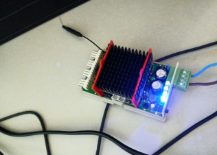

Illustration 1-Appearance of the OZM
Precisamente gracias a las características del OZM, el objetivo de este trabajo es usando los datos arrojados por los nuevos dispositivos, mostrar el uso y potenciales aplicaciones en cuanto a la desegregación de la energía con estos datos, adaptando para ello la herramienta de monitoreo de carga no intrusivo NILMTK. Hay que destacar que para capturar los datos de los OZM tanto sin usar armónicos como usando los armónicos de tensión, corriente y potencia hasta el orden 50, así como asociar los correspondientes metadatos del OZM, se proporcionan dos nuevos conversores y convertidores que nos han permitido crear dos nuevos DS: DSUALM y DSUALMH almacenándose en el formato HDF5.

# RELATED WORK#

En cuanto a los métodos existentes de desagregación de energía se pueden clasificar en cuatro grupos principales: **métodos de optimización** (destacando Vector Support Machines o SVM , Bird swarm algorithm o BSA , algoritmos genéticos y Particle Swarm Optimization o PSO entre otros), **métodos supervisados** (destacando los clasificadores bayesianos , Support Vector Machine o SVM , el algoritmo Discriminative Disaggregation Sparse Coding o DDSC , las Redes Neuronales Artificiales o ANN, así como sus extensiones), **métodos no supervisados** (destacando el de optimización combinatoria o CO, los modelos de Markov o HMM y sus extensiones, como el FHMM ), y **otros**.

Public Datasets
On the other hand, there are Public Datasets that can be used to test and compare the results offered by different energy disaggregation algorithms, among which we highlight:

Notable Datasets
AMPds: Readings for a 1-minute overall meter, as well as sub-metered readings of 19 individual circuits.

DRED: Electricity data, environmental information, occupancy information, and household information.

ECO: 1 Hz aggregate consumption data and also data taken at 1 Hz from selected appliances in 6 households for 8 months.

GREEND: Power data taken at 1-second intervals from 9 appliances and the total energy demand of 9 households over one year.

HES: Measurements of 51 appliances at 2-minute intervals from 251 households over 12 months.

IAWE: Aggregate measurements and sub-measurements of electricity and gas from 33 appliances at 1-second resolution over 73 days from one household.

REDD: Power measurements at 3-second to 4-second intervals from 6 US households.

REFIT: Aggregate and 9 individual appliance power measurements from 20 homes, with a resolution of 1 sample every 8 seconds.

UK-DALE: 16 kHz aggregate measurements and 6-second sub-metered energy data from individual appliances in 3 UK homes, as well as 1-second aggregate and 6-second sub-metering for 2 additional homes.

DEPS: 1 Hz readings on 6 devices present in a classroom taken over one month

# ARCHITECTURE

For the disaggregation process we will use the NILMTK Toolkit, the flow of which can be seen in the illustration below.

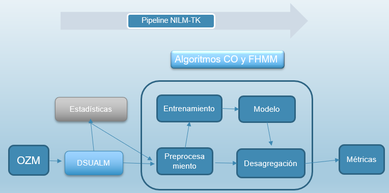

Illustration 2-Flow chart NILMTK

1.  **Generation of the new SDs**

The models presented in this paper make use of data from recordings of several hours of operation of different devices, using the OZM API, collecting fundamental and secondary electrical characteristics, such as complex harmonic values of current, voltage and power up to order 50.

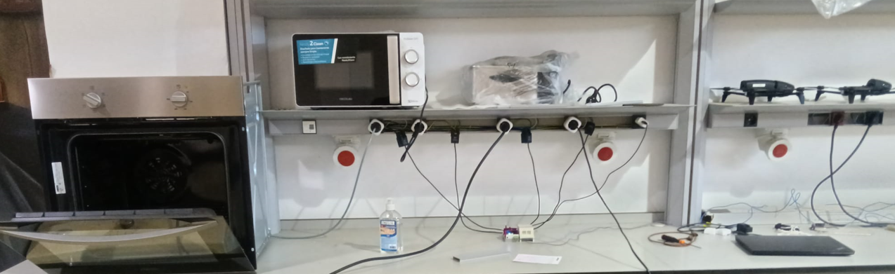

Ilustración 3-Toma de medidas con OZM

We have as a container for the measurements collected from the OZMs, files with 160 data fields, fields, by the way, not all of which will be relevant, at least in the first phase of the study, so we need to adapt them for use in the NILMTK.

In a first step, we will make a preliminary analysis of the data files, for which, initially, both the metadata and the data are analysed, whose structure should be based on the NILMTK-DF format.

Next, we need new converters where we will make a series of manipulations with the information of the fields provided in the data files in hdfs or csv format, which will lead us to the creation of the final output data files, which we will save in csv format.

The next task is the conversion of the different measurement files in csv format pre-processed in the previous phase to a single common file in HDF5 format), which we store in the "/data/" folder which **also contains all the DS metadata.**.

Normally standardised DS formats are used in NILMTK, but given the exclusivity of the data offered by the OZM, we require a new data format, for which we created two functions: **convert_ualm** and c**onvert_ualmt** (to process the transients).

In the directories of the new converters we place not only the Python code of the new converters, but we also include new subdirectories in "/metadata/", which will include the metadata files in yaml format. We can see in Illustration 4 the configuration of all the necessary files for the converters, as well as the required directory structure.

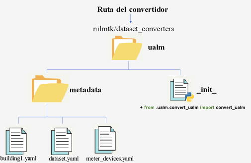

Illustration 4-Metadata file structure

As each csv file is obtained in the previous phase from the OZM files, it is necessary to number them, with number 1 corresponding to the main meter. To do this, the new function accesses all the aforementioned measurement data files located in the input folder "/electricity/", using the labels.csv file, a process that is shown in Illustration 5.

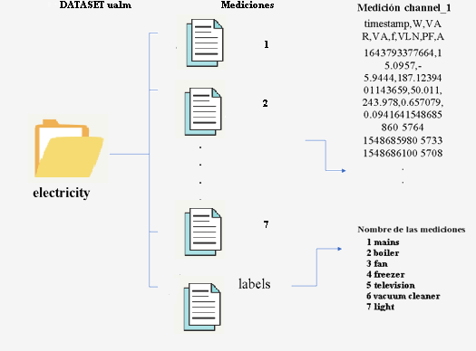

Illustration 5-Data file structure

Once all the measurement files have been processed, we proceed to merge them in yaml format, and then convert the data structure into a new DS in H5 format. Once the data files are located, the first thing to do is to invoke the DS converter by calling the new function **convert_ualm**, passing it the path of the metadata and the new name of the DS file that will be generated in H5 format. Once the new DS is created, we can perform a pre-analysis of the data, being especially interesting to represent the voltage, power and current graphs for the different applications.

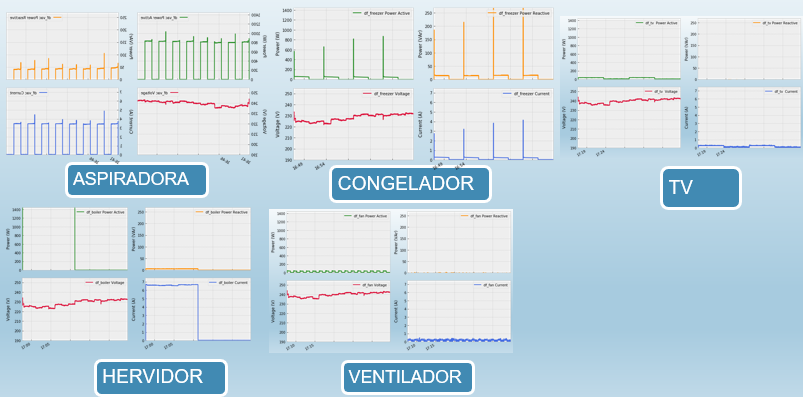

Illustration 6- Representation of measurements

1.  **Analysis, Pre-processing, Training, Validation, Disaggregation and Metrics**

Once we have generated the new DSs, we can use the implementations available in NILMTK to perform a quick diagnosis of the DS. It is especially interesting to obtain the voltage profile and to obtain the area graph of the applications (Illustration 7).

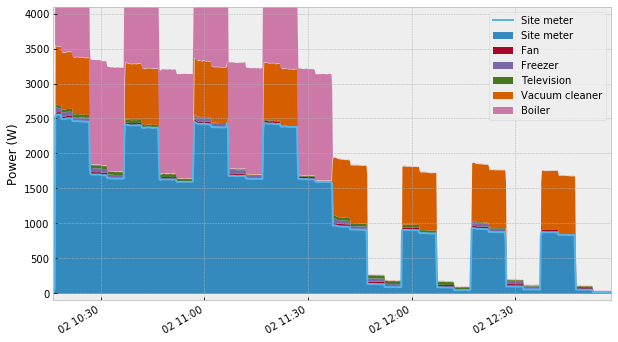

Illustration 7-Voltage profile

It is also interesting to be aware of possible missing sections or to discard samples with very low values (by applying filters).

Finally, after analysing the data, we will divide the DS into **training set, validation set and test set.** To train the model, we use two of the disaggregation models available in NILMTK, such as the supervised algorithms CO and FHMM, using the active power signal of the devices. To do this, in addition to loading the necessary libraries, we will first define the DS and associate the labels associated with the appliances, and we can then define the training subset.

Once the training model is defined, thanks to the fact that NILMTK implements the two desegregation algorithms, we will run the two algorithms CO and FHMM at these time intervals (10", 30", 60", 5', 10", 15"), for the three methods (First, Mean and Median), saving the models generated in H5 format. It would only be necessary to implement the best evaluated model in the validation stage, and in this way we can compare the real signal (GT) against the one predicted by the best model.

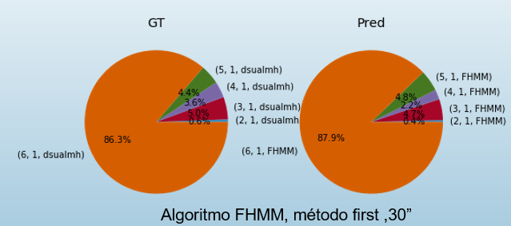

Illustration 8-Comparison of GT with actual measurements

As we can see, the results are quite good in terms of predictions, since, for example, for the kettle (in blue) there is only a small deviation of 0.2% from the actual data. Likewise, both the fan (in red) and the light (pink) show a minimal deviation and the hoover (in orange) only shows a deviation of 1.6%.

# RESULTS

NILMTK has the calculation of evaluation metrics through the use of the MeterGroup, for the validation of the results by means of the validation set. It is necessary to run different metrics such as FEAC, F1, EAE, MNEAP and RMSE on the models obtained, which gives us an output similar to Table 1.

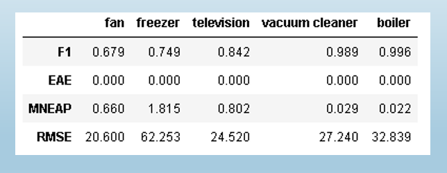

Table 1-Main metrics obtained for the applications

**F1 and MNEAP**

In terms of F1, the incorporation of transients allows an improvement for the kettle and the hoover, while maintaining for the fan and freezer and worsening for the TV.

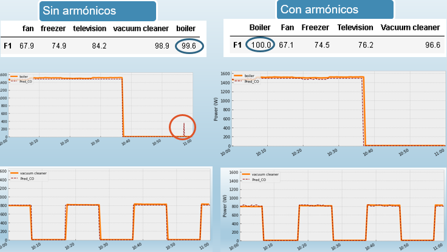

Illustration 9-Comparison with and without transients for F1

With respect to MNEAP, the incorporation of harmonics improves the performance for the fan and, notably, for the freezer, maintaining similar values for the rest of the appliances.

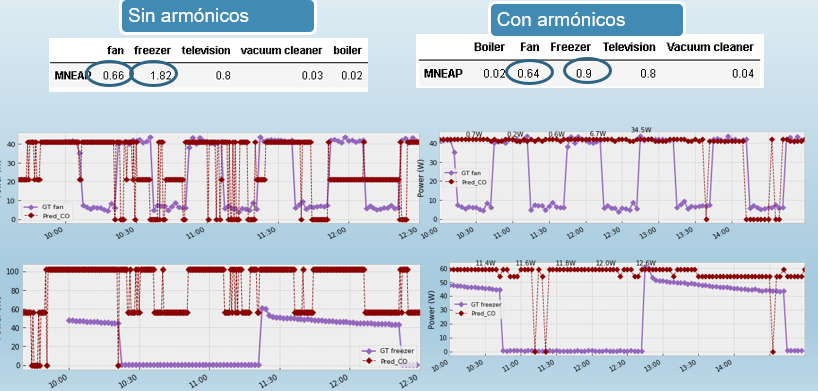

Figure 10-Comparison with and without transients for MNEAP

** RMSE**

In terms of RMSE, the improvement of the freezer clearly stands out (**from 62.25 to 35.9**) followed by a timid improvement in the TV (from 24.5 to 23.2). Regarding other appliances, the fan remains the same, and both the kettle and the hoover worsen.

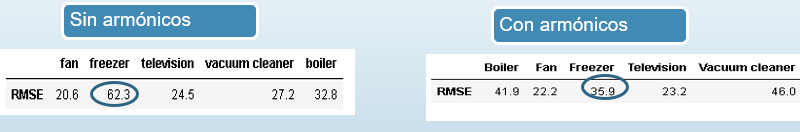

Table 2-Comparison with RMSE transients

**Summary of results with and without harmonics**

In general, the incorporation of transients improves all metrics for almost all applications. Particularly noteworthy are the fan and freezer. For TV it would only worsen for F1 and for hoover or kettle it would only worsen for RSMSE.
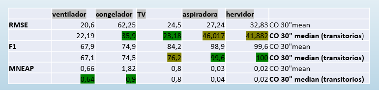

Illustration 11 Summary metrics with and without harmonics

**Comparison with other DSs**

For the IAWE DS the results show that the most efficient algorithm for this DS is the combinatorial (CO) algorithm using the Mean method and **period 10 minutes versus only the 10 seconds needed with the OZM** data.

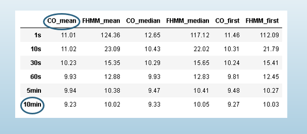

Illustration 13 IAWE results

On the other hand, the results obtained for the DS of DEPS show a better performance for the CO algorithm, Mean method, but **at a sampling time of half an hour compared to only 10 seconds for the OZM data**.
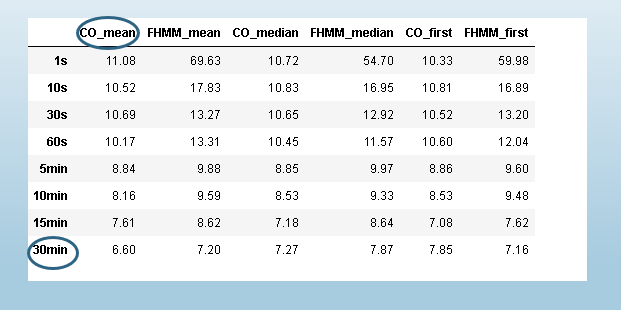

Illustration 14-DEPS Results

Likewise, if we compare GT and Pred for the DS of DEPS, the divergences are very important, ranging between 1.4%, 4.6% and 4.9% compared to 0 and 1.6% for DSUAL.

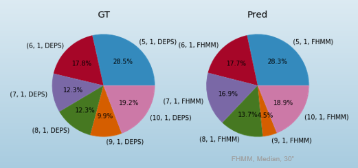

Illustration 15-Comparison GT with Pred for DEPS

# CONCLUSIONS

In this work in the field of NILMTK, in addition to incorporating both the metrics and the tools available in the toolkit, a new 13-digit timestamp format has been incorporated as well as two new converters for measurements obtained from OZM (with or without transients) and two new converters based on IAWE (with or without transients), thus eliminating the entry barrier for any researcher who has one or more OZM and wishes to access NILM.

On the other hand, if we compare the results of the metrics obtained on DSUALM or DSUALMT, compared to IAWE or DEPS, the results are much worse, especially in terms of the sampling period required, with the values obtained for the MNEAP metric standing out.In this work in the field of NILMTK, in addition to incorporating both the metrics and the tools available in the toolkit, a new 13-digit timestamp format has been incorporated as well as two new converters for measurements obtained from OZM (with or without transients) and two new converters based on IAWE (with or without transients), thus eliminating the entry barrier for any researcher who has one or more OZM and wishes to access NILM.

# Publications

There is an article by me about the NILM using single-phase OZM hardware instead of OZM v2:There is an article by me about the NILM using single-phase OZM hardware instead of OZM v2:\- C. Rodriguez-Navarro, A. Alcayde, V. Isanbaev, L. Castro-Santos, A. Filgueira-Vizoso, and F. G. Montoya, “DSUALMH- A new high-resolution dataset for NILM,” \*Renewable Energy and Power Quality Journal\*, vol. 21, no. 1, pp. 238–243, Jul. 2023, doi: 10.24084/repqj21.286.

Also, in order to make all this work replicable, a new open multi-counter called OMPM has been developed and is published in the scientific journal "Inventions".Also, in order to make all this work replicable, a new open multi-counter called OMPM has been developed and is published in the scientific journal "Inventions".\- C. Rodríguez-Navarro, F. Portillo, F. Martínez, F. Manzano-Agugliaro, and A. Alcayde, “Development and Application of an Open Power Meter Suitable for NILM,” \*Inventions\*, vol. 9, no. 1, p. 2, Dec. 2023, doi: 10.3390/inventions9010002.

